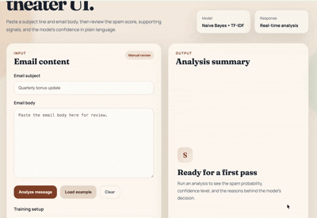

# AI-Based Spam Email Detection System

A Machine Learning based spam email classification system built using Natural Language Processing (NLP) techniques and multiple classification algorithms to detect spam and non-spam messages with high accuracy.

## Demo



## Features

- Spam and non-spam message classification
- Text preprocessing and cleaning
- TF-IDF vectorization
- Multiple ML model comparison
- WordCloud visualization
- Accuracy comparison chart
- Confusion matrix generation
- Custom message prediction
- Model saving using Joblib
- Web-based prediction interface using React and FastAPI

## Technologies Used

- Python
- React
- FastAPI
- Pandas
- NumPy
- Scikit-learn
- Natural Language Processing (NLP)
- TF-IDF Vectorization
- Naive Bayes
- Logistic Regression
- Support Vector Machine (SVM)
- Matplotlib
- Seaborn
- WordCloud
- Joblib

## Dataset

Dataset Used: **SMS Spam Collection Dataset**

Dataset Link:  
https://archive.ics.uci.edu/ml/datasets/sms+spam+collection

Dataset Download:  
https://archive.ics.uci.edu/ml/machine-learning-databases/00228/smsspamcollection.zip

## Project Workflow

```text
Dataset
   ↓
Data Cleaning
   ↓
Text Preprocessing
   ↓
TF-IDF Vectorization
   ↓
Model Training
   ↓
Prediction
   ↓
Performance Evaluation
```

## Machine Learning Models Used

- Naive Bayes
- Logistic Regression
- Support Vector Machine (SVM)

## Results

| Model | Accuracy |
|---|---:|
| Naive Bayes | 98.30% |
| Logistic Regression | 97.49% |
| SVM | 98.83% |

SVM achieved the highest accuracy for spam classification and is the model currently used by the app.

## Visualizations Included

- Spam vs Ham Graph
- Spam WordCloud
- Ham WordCloud
- Accuracy Comparison Chart
- Confusion Matrix


## Repository Structure

```text
AI-based-spam-mail-detection/
├── backend/
│   ├── artifacts/
│   ├── main.py
│   ├── model.py
│   ├── model_metadata.json
│   ├── preprocessor.py
│   ├── requirements.txt
│   ├── spam_model.joblib
│   ├── tfidf_vectorizer.joblib
│   └── train_model.py
├── frontend/
│   ├── src/
│   ├── index.html
│   └── package.json
├── dataset/
├── screenshots/
└── README.md
```

## How to Run

### 1. Install Dependencies

From the project root:

```bash
python3 -m venv .venv
source .venv/bin/activate
pip install -r backend/requirements.txt
cd frontend
npm install
cd ..
```

### 2. Train the Models

```bash
cd backend
../.venv/bin/python train_model.py
```

### 3. Run the Backend

```bash
cd backend
../.venv/bin/uvicorn main:app --host 127.0.0.1 --port 8000
```

### 4. Run the Frontend

Open a second terminal:

```bash
cd frontend
npm run dev -- --host 127.0.0.1 --port 5173
```

### 5. Test the App

1. Open the frontend URL in your browser
2. Click `Load example`
3. Click `Analyze message`
4. Review:
   - classification
   - spam probability
   - confidence
   - model used


## Authors

- Daniya Ishteyaque
- Adrija Tarafder

## Academic Details


| Field | Information |
|---|---|
| Course Name | Programming & Employability Skills for Computer Engineers |
| Course Code | SKE309 |
| Semester | 06 |
| Program | B.Tech (CSE) |
| Section | A |
| University | Amity University Kolkata |

## Conclusion

This project demonstrates the practical implementation of Machine Learning and NLP techniques for automated spam detection. The system achieved high accuracy using the SMS Spam Collection dataset and can be extended further for real-world spam filtering applications.
